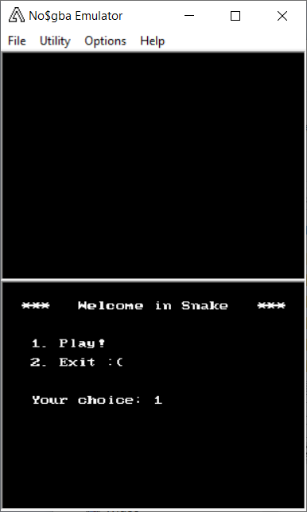
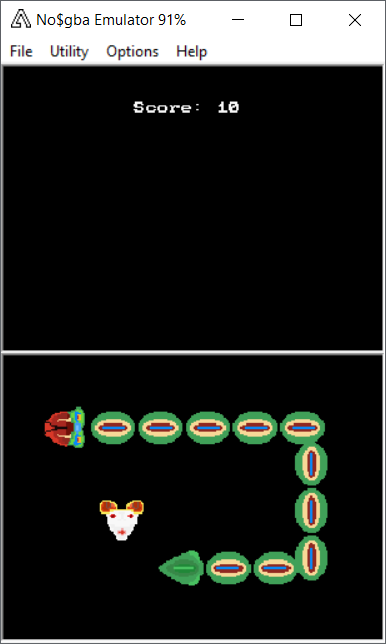

# Snake_NDS
Classic Snake for the game console Nintendo DS implemented with help of the devkitPro Toolchain.
To play simply download the *.nds file and run it with an emulator like no$gba.

# Features to implement:
  - Walls
  - Dual Screen Gameplay

# Shots from the game

 